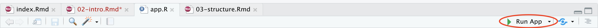

# Introduction{#intro}

## What is Shiny

Shiny is an R package that makes it easy to build interactive web applications. It provides an easy way to present R data analysis interactively and over the web. It is magical in  the sense that it allows you to create complicated apps without any prior knowledge of HTML, CSS or JavaScript straight from your R code. Shiny essentially wraps your R code and transforms it into a dynamic web app. The powerful features of shiny are the interactions with the User Interface (UI) and the reactivity of the app on the data, which will be discussed in later sections.

To use it, simply open up R Studio and:
```{r install_shiny, eval=T, echo = T}
# install.packages("shiny")  ## if shiny has not been installed in your R instance, uncomment this and run this
library(shiny)
```


## Another R package - What's so special about Shiny?

* It's easier than learning HTML, CSS and JavaScript, although you can use those to build your own custom Shiny elements

* You don't need to port any of your R code into another language in order to build a web app

* Incredible flexibility, you can generate dynamic UI elements and create interactive plots

* It adds reproducibilty to your graphs

* Allows end user interaction on complex datasets with collaborators who may not know how to code in R

* You don't need to generate a billion plots manually. It can easily be added to a markdown document.

## Example apps

Here are some apps made by the team within the Monash Bioinformatics Platform:

* [Anup and Sarah's Enrichment app: ](https://bioinformatics3.erc.monash.edu/rsconnect/content/241/) Calculates enrichment score for differential gene list.

* [Paul's Varistran app](http://rnasystems.erc.monash.edu:3838/pfh/2015/demo-varistran/) Varistran is an R package that provides a Variance Stabilizing Transformation appropriate for RNA-Seq data, and generates a variety of diagnostic plots based on such transformation.

* [R Studio's CRAN logs app: ](https://gallery.shinyapps.io/087-crandash/) Displays 1-week delayed streaming data from the RStudio CRAN mirror logs.


## Create your first Shiny App

### Activity 1: Creating a ShinyApp that prints "Hello, World!" {- .activity}
Create a new project within RStudio called `app_hello`. Then:
Create a new .R file, paste the following code inside, save it as app.R inside the folder `app_hello`. (RStudio recognises this is a shiny app, because of the filename `app.R` and the format of the script within, a Run App button appears upon saving)

```{r, eval = F, echo = T}
library(shiny) #1. calls the library `shiny`
ui <- fluidPage( #2. defines user interface, an HTML webpage
  "Hello, world!" # prints Hello, world! on webpage
)
server <- function(input, output, session) { #3. specifies app behavior
}
app_hello <- shinyApp(ui, server) # 4. starts Shiny application
```

Click on `Run App` in the top right corner (see fig below). Or you can also use the keyboard shortcut: Cmd/Ctrl + Shift + Enter. 
Run the script so the objects are loaded into the R environment.

{width=100%}

### Breakdown of the code
This is a trivial Shiny app that performs 4 tasks:

1. Calls the `shiny` package.

2. Defines user interface (ui) which in this case is an HTML webpage, for us to interact with. In this user interface, it prints "Hello, world!".

3. Creates a function called server that specifies app behavior. Currently, the function body is empty. It means this function (and the app) doesn't do anything except for printing "Hello, world!" We will later add more controls to this function to control app behavior.

4. Construct a Shiny application from UI and server and stores it in a variable called `app_hello`.

> In the R console, there is some text displayed in red which indicates the URL of your app. Your app can be found at 127.0.0.1, indicates "this computer" and 5537 is a randomly assigned port number.

### Running a Shiny App
Aside from the `Run App` button and the shortcut, there are many other ways to run a shiny app:
```{r, eval = F}
runApp(app_hello)
runGadget(app_hello)  
runGadget(app_hello, viewer=dialogViewer("App 1"))
print(app_hello)
app_hello
```

### Challenge 1: Now, open the `app_ui.R` inside `ShinyApps` folder and examine what it does (Breakout).{- .challenge}
First run the app as it is. Then uncomment the lines and run again and observer the changes. Can you explain the function of this app?
