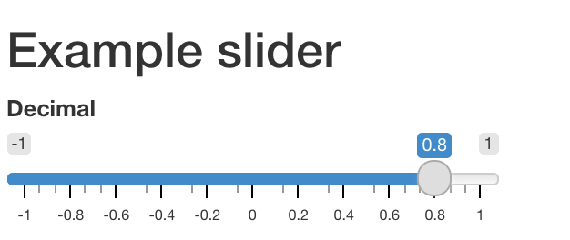
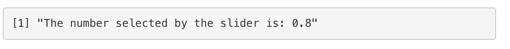
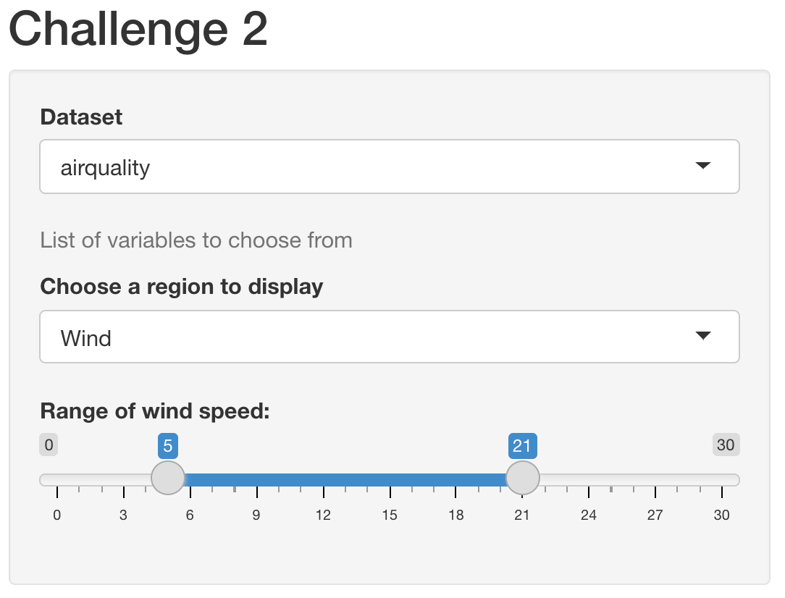

# Structure of a Shiny App{#structure}

A shiny app looks quite different from a typical R script. A basic Shiny app consists of two objects:

* UI object - contains the code for the UI (user interface) elements i.e the visible part of the app; takes input and displays output.

* server object - contains the code for all the calculations the app will need. It contains the logical part of the code and access input from UI, performs the computation and generates an output which is returned to the UI.

<center></center>

<p>&nbsp;</p>

The skeleton of a Shiny app looks like:
```{r, echo = T, eval = F}
library(shiny)

ui <- fluidPage(
  # front end interface
)

server <- function(input, output, session) {
  # back end logic
}

shinyApp(ui, server) # runs the app
```

Originally shiny apps were written across two files, one called `ui.R` and the other `server.R` - with the code for the ui seperate in the UI file and the code for the server function contained in its own file. You may encounter this structure if you examine the code for an old applications. It is still possible to write shiny applications this way but we will not be covering it in this course. We will be teaching you how to write apps in 1 file. 

## UI 

This is the front-end of the shiny app that allows you to capture (input) and display (output) a variety of data types. Fundamentally the UI is an HTML document with shiny functions returning chunks of HTML code. Fortunately, we don't have to write the HTML code directly ourselves, Shiny has R functions that do that instead.

The UI object controls the layout and appearance of the app. The UI makes use of widgets to interact with data. In this section, we'll look at examples of layouts and shinyWidgets that insert input controls.

Here's an example of a widget: a basic slider. Open the `app_slider.R` inside `ShinyApps` folder to understand how the slider widget works.

```{r widget1, echo = T, eval = F}
library(shiny)
sliderInput("slider1", "Decimal",
            min = -1, max = 1,
            value = 0.8, step = 0.2)
```

{width=50%}

```{r, echo= T, eval = F}
renderPrint({paste("The number selected by the slider is:", input$slider1)})
```

{width=60%}


```{r}
library(shiny)
fluidPage(
    
  # Copy the chunk below to make a group of checkboxes
  checkboxGroupInput("checkGroup", label = h3("Checkbox group"), 
    choices = list("Choice 1" = 1, "Choice 2" = 2, "Choice 3" = 3),
    selected = 2),
  
  
  hr(),
  fluidRow(column(3, verbatimTextOutput("value")))
  
)


```

The [shiny gallery](https://shiny.rstudio.com/gallery/#demos) has a section for application layouts. This is a useful of resource for ideas on how to structure the appearance of your app.

To see what widgets are available, look at the [Shiny widget gallery.](http://shiny.rstudio.com/gallery/widget-gallery.html) or consult the [Shiny cheatsheet](http://shiny.rstudio.com/images/shiny-cheatsheet.pdf).

## Layout

The complexity of your application may have an impact on the complexity of your layout. For instance, an application that contains only one or two widgets and one or two outputs may only need one page to fit all these elements. If however there are lot of controls and results to display it might be easier to organize these under tabs or a navbar.

A layout with three panels: a title panel, a sidebar panel and a main panel.
```{r,eval=FALSE}
ui <- fluidPage( # fluidPage - this function creates a display that auto adjusts to the browser window
  # further elements set to define the appearance will be placed within fluidPage
  titlePanel("this is a title panel"),
  
  sidebarLayout( # this function creates a layout with two pane21ls, one panel takes about a third of the screen width, the other panel takes about two thirds of the screen width.
    # the position of the sidebar can be moved by providing the `position = "right" argument to the sidebarLayout function
    sidebarPanel("this is the sidebar panel"),
    mainPanel("this is the main panel")
  )
)
```

This is where Shiny starts to get a little tricky, a lot of ui code will be end up being nested in more code. So far, we have the `sidebarPanel` widget nested inside `siderbarLayout` **which is nested in** `fluidPage`. So we've stuck a function inside a function inside a function. Phew, that's a lot to keep track of! We could easily place widgets inside the `sidebarPanel` function - they'd be nested even futher! Many common problems that'll prevent a shiny app from running simply come from just putting a comma or a bracket in the wrong place. 

>We cannot emphasis this point enough - **keeping track of opening and closing brackets and your commas is a good skill to cultivate when building Shiny apps!** One quick way to check on your brackets is to move the cursor next to a bracket - in RStudio - that will highlight the other bracket paired with if (if one exists, that is!).
>
>
>
>*Fig 1. The cursor is placed next the opening bracket for `mainPanel` and the closing bracket is highlighted.*
>
>
>
>
>*Fig 2. Here, though the cursor is in the same place but the original closing bracket to `mainPanel` is missing. The next closing bracket is used by `mainPanel` instead, which now means `sidebarLayout` does not have a closing bracket. The app would not work in this situation.*

The degree to which functions are nested in each other to build the UI can be overwhelming to look at when you are getting started. As you become more experienced with writing Shiny, you'll get used to examining your UI element code with an eagle eye to make sure you haven't misplaced a comma or bracket. 

The above layout is probably the most common layout used with shiny apps. It's good for an app with only a few number of components. You may want to add a navbar and tab sets if you have a large number of components.

```{r}
ui <- fluidPage( 
  titlePanel("this is a title panel"),
  
  sidebarLayout( 
    sidebarPanel("this is the sidebar panel"),
    mainPanel( 
      tabsetPanel( # this function takes an argument of `position = "left"` (arguments can be "left", "right", "below". default is above)
        # this argument directs where the tabs are positioned
        tabPanel("plot results"),
        tabPanel("table results"),
        tabPanel("fun gifs")
      )
    )
  )
)
```

For more information about the application layout (including nav bars and lists), we recommend this [resource](https://shiny.rstudio.com/articles/layout-guide.html). For more information about tab sets specifically, we recommend this [article](https://shiny.rstudio.com/articles/tabsets.html).

Another thing to note that a lot of the functions that build the UI are essentially wrapping HTML code within R functions. This means that the UI can also be customized by directly writing HTML code or by using [wrapper tag functions](https://shiny.rstudio.com/articles/tag-glossary.html). This is beyond the scope of this course but we thought it was worth mentioning.

### Activity 2: Does the `tabsetPanel` need to be nested in the `sidebarLayout`? {- .activity}


## Widgets

Widgets are UI elements that allow the user to input and change the values that are used to by the application to perform a calculation and return a result.

There is a wide variety of available pre-built widgets but all of them share a common basic framework. All widget input functions have the same first argument i.e. `inputId`. This is an identifier that connects the UI with the server. If for example `inputId = select`, you can access the input in the server as `input$select`. We'll discuss more about the server in the next section.

* The `inputId` is like a variable in R and must follow the naming convention. It must be a string that may contain only letters, numbers, and underscores.

* Like a variable, the `inputID` has to be unique so it can be accessed inside the server.

Here are some more examples of Shiny widgets:
```{r, echo = F}
shinyUI(navbarPage("Navbar",
                   tabPanel("Widgets!",
                            selectInput("select", label = h3("Select box"), 
                                        choices = list("Choice 1" = 1, "Choice 2" = 2, "Choice 3" = 3), 
                                        selected = 1),
                            renderPrint({input$select}),
                            textInput("text", label = h3("Text input"), value = "Enter text..."),
                            renderPrint({input$text})
                   ),
                   tabPanel("More widgets!",
                            checkboxGroupInput("checkGroup", label = h3("Checkbox group"), 
                                               choices = list("Circle" = "circle", "Square" = "square", "Triangle" = "triangle"),
                                               selected = "circle"),
                            
                            renderPrint({ input$checkGroup })
                   )
)
)

```

We can examine the code that generates the `selectInput` with the title 'Select box':

```{r, eval = FALSE}
selectInput(inputId = "choice_select", label = "Select box",
            choices = list("Choice 1" = 1, "Choice 2" = 2, "Choice 3" = 3),
            selected = 1)
```

The `inputId` is `choice_select`, so if we want to use the values generated by this widget on the server side, we'd access it with `input$choice_select`. You can name the `inputId` however you like so long as you don't use the same id for another input widget but it's generally useful to name it something related to whatever that input is doing. The `label` arguement is the text to be displayed above the widget in the UI. The `choices` argument takes a list. This list can either be unnamed or named. In the case of a named list, such as the one above, the names will be displayed on the UI (e.g "Choice 1") while the value (e.g 1) will be passed to the server side to be use1d for further computations. For an unnamed list, the value will both be displayed on the UI and passed to the server side. The `selected` arguement tells Shiny which of the list values it should display by default when the app loads - in this case, it will start with the value in the choices list that matches the value of `1`, which is `Choice 1`.

To learn more about the arguments that a widget takes, the [Widget Gallery](https://shiny.rstudio.com/gallery/widget-gallery.html) is usually a good starting point.

### Activity 3: Now, open the `widgets.R` inside `ShinyApps` folder, and try running it.{- .activity}
There are a variety of widgets available in Shiny Apps. Have a go at them!!

Please Note: For now, keep the `Server Logic` and `Run the App` as it is. We'll explain these in next sections.

## UI Output

The UI also contains elements for displaying output results. The list of this is not as expansive as the widgets and can be [found here (under UI outputs)](https://shiny.rstudio.com/reference/shiny/1.7.0/). The type of result you want displayed in your application determines the type of UI element that you need.

For example, if your application is going to return a text result, then you probably want a `textOutput` element:

```{r}
ui <- fluidPage( 
  sidebarLayout(
    sidebarPanel(), # Put your input widgets on this panel
    mainPanel(
      textOutput(outputId = "text_result")
    )
  )
)
```

Similar to the `inputId` for widgets, the `outputId` for each output element needs to uniquely named. 

The main output elements commonly used are `textOutput`, `plotOutput` and `tableOutput` and they are used respectively for displaying text, plots and tables as their names suggests. 

```{r}
ui <- fluidPage( 
  sidebarLayout(
    sidebarPanel(), # Put your input widgets on this panel
    mainPanel(
      textOutput(outputId = "text_result"),
      plotOutput(outputId = "plot_result", width = "400px", height = "100%" )
    )
  )
)
```

While the output functions do take a few arguments, generally the most you need to do is give them an `outputId`. If you are looking at the `plot_result` function and wondering where the code to generate the plot belongs, then it's time to move on to the server function.  

## Server

The server function is the back-end of the application. It contains the code for data processing, analysis and plotting. It takes input from the UI, runs (and re-runs) code chunks defined within, generates a result and sends it to the UI output elements.

The server logic follows reactive programming, which defines a graph of dependencies. The idea is that when the input changes, all related outputs are updated. This makes the Shiny App interactive. 

In the Shiny skeleton code, server is defined as a function with three arguments- input, output and session. These arguments are created by Shiny when the application starts and cannot be changed.
```{r, eval = F}
library(shiny)

ui <- fluidPage(
  # front end interface
)

server <- function(input, output, session) {
  # back end logic
}

shinyApp(ui, server)
```

Whereas the UI object contained functions for defining the interface of the application, the server function defines the logic of what to do with those inputs and outputs. It typically contains reactive variables (we'll cover those next chapter) and `renderX` functions that direct the result of a calculation to an output ui element. For each of the different types of output elements (`textOutput`, `plotOutput`, `tableOutput`), there is a corresponding render function i.e (`renderText`, `renderPlot`, `renderTable`).

The `render` function sets up a special "reactive context" that automatically tracks the input values the output has used. It also converts the output of your R code into HTML to be display on a web page.

The structure in the server function typically looks like this:

```{r}
server <- function(input, output, session) {
  
  # We assign the result of a render function to an output element
  output$plot_result <- renderPlot({ 
    ## Code to do a calculation that generates a plot result
    ## This where your 'regular' R code is placed
    ## to access values from widgets, use the syntax input$widget_id
    
    ## The function below will subset the airquality dataset into 2 columns
    ## It grabs column 4 (Temp) and either columns 1-3 
    ## depending on the choice from the selectInput called choice_select
    df <- airquality[, c(4, as.numeric(input$choice_select))]
    
    ## This function now plots the two columns
    ## We can change the data being plotted on the y-axis
    ## Whenever we change the value selected by the 
    ## selectInput widget
    plot(x = df[, 1], y = df[, 2])
  })
}
```

For each output element that we create in the UI, if we want it to display a result, we then need a corresponding `renderX` function in the server side that directs a results to be displayed e.g:

```{r}
server <- function(input, output, session) {
  
  output$text_result <- renderText({
    ## the print function here is optional
    ## including it means that it will print the results to the console while the app is running
    ## which is a useful way to debug what you app is doing 
    print(paste("The selected column index is:", input$choice_select))
  })

  output$plot_result <- renderPlot({
    
    plot(x = airquality[, 4], y = airquality[, as.numeric(input$choice_select)])
  
  })
}
```

Let's put togther all that we've learnt about widgets, ui output and the server to create a minimal application that will let you select the values plotted on the y-axis from the `airquality` dataset against the temperature column. (If you want to examine the airquality data-frame, use `head(airquality)` to look at the top rows.)

```{r, eval=FALSE}
library(shiny)
ui <- fluidPage(
    selectInput(inputId = "choice_select", label = "Select box",
            choices = list("Choice 1" = 1, "Choice 2" = 2, "Choice 3" = 3),
            selected = 1),
    mainPanel(
        plotOutput(outputId = "plot_result")
    )
)
server <- function(input, output, session) {
  
  output$plot_result <- renderPlot({
    
    plot(x = airquality[, 4], y = airquality[, as.numeric(input$choice_select)])
  
  })
}
shinyApp(ui, server)

```


### Input

This is a list-like object that contains all input data from the UI. The input data can be accessed as `input$inputId`, where `inputId` is defined in the UI for any given widget. For example, if we refer back the check-box below, we specified the `inputId` as `checkGroup`. We can access the value of that specific input using `input$checkGroup`. It will contain the value `1` as we specified this in the `selected` argument. This value will be updated everytime a user selects a different check-box.


```{r, eval = F}
ui <-  fluidPage(
  # Copy the chunk below to make a group of checkboxes
  checkboxGroupInput(inputId = "checkGroup",
                     label = h3("Checkbox group"),
                     choices = list("Choice 1" = 1,
                                    "Choice 2" = 2,
                                    "Choice 3" = 3),
                     selected = 1)
)
```

### Output
This is also a list-like object named according to the `outputId` arguments created in the UI. In the following example, the `outputId` for the `textOutput` is defined as `greeting` inside the UI. Inside the server function, the output is stored in the `outputId` using `output$greeting` (think of it as a storing a value inside a variable). Alternatively, think of it as a way to direct the results of a computation on the server side to a specific `outputID`. 

The value of the `greeting` is `Hello, World!` 

```{r, eval = F}
ui <- fluidPage(
  textOutput(outputId =  "greeting") # defines outputID
)

server <- function(input, output, session) {
  output$greeting <- renderText("Hello, World!") # stores output in the outputID
}
```


### Challenge 2: Rewrite your `ui` to create a Shiny app that contains following (Breakout).{- .challenge}

1. Title that says "Challenge 2"

2. Select `airquality` from the default datasets in R (Hint: Refer to `app_ui.R`).

3. Create three widgets:

   * `helpText()` to write "List of variables to choose from".
   
   * `selectInput()` to list variables in the `airquality` dataset. 
   
   * `sliderInput()` to add a slider where, `min = 0`; `max = 30` and selected values are: `(5,21)`
   
4. Try replacing the list options in selectInput by `colnames(airquality)`.

Your Shiny app should look like this:

{ width=350px }
<p>&nbsp;</p>
> Hint: Use the Shiny skeleton code to create a new R-script and edit the UI part:

```{r, eval = F}
library(shiny)

ui <- fluidPage(
  # edit this part
)

server <- function(input, output, session) {
  
}

shinyApp(ui, server)
```

