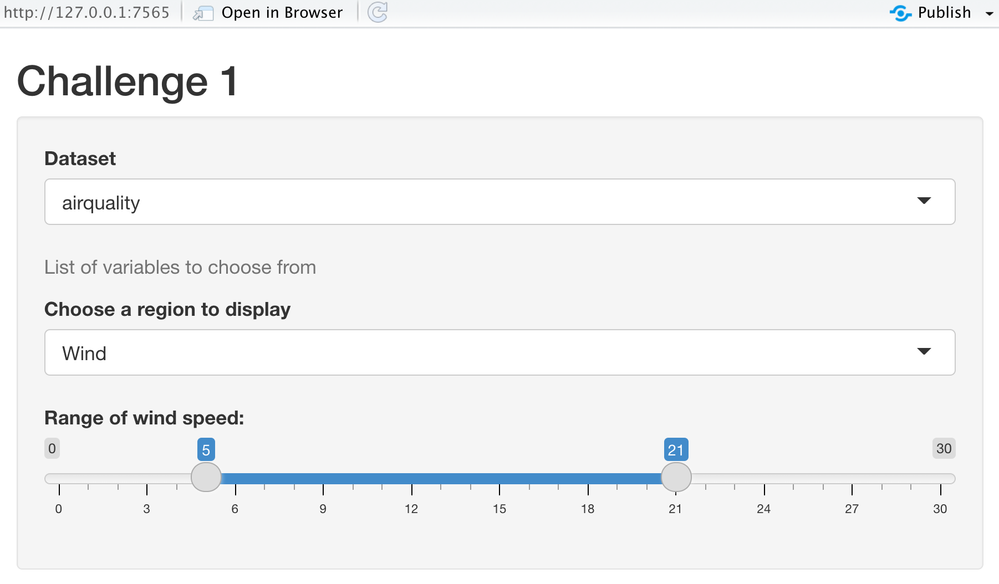

# Structure of a Shiny App{#structure}

A basic Shiny app consists of two objects:

* ui object - contains the code for the UI (user interface) elements i.e the visible part of the app 

* server object - contains the code for all the calculations the app will need. Generates an output which is returned to the ui.


<center></center>

## ui
The ui object controls the layout and appearance of the app. The ui makes use of widgets to interact with data.

```{r widget1, echo = T}
library(shiny)
sliderInput("slider1",
            label = h4("This code will make a slider \n"),
            min = 0, max = 100, value = 50)
```

```{r, echo= T, eval = F}
renderPrint({paste("The number selected by the slider is:", input$slider1)})
```

```{r}
fluidPage(
    
  # Copy the chunk below to make a group of checkboxes
  checkboxGroupInput("checkGroup", label = h3("Checkbox group"), 
    choices = list("Choice 1" = 1, "Choice 2" = 2, "Choice 3" = 3),
    selected = 1),
  
  
  hr(),
  fluidRow(column(3, verbatimTextOutput("value")))
  
)


```

## Widgets and layout

```{r, echo = F}
shinyUI(navbarPage("Navbar",
                   tabPanel("Widgets!",
                            selectInput("select", label = h3("Select box"), 
                                        choices = list("Choice 1" = 1, "Choice 2" = 2, "Choice 3" = 3), 
                                        selected = 1),
                            renderPrint({input$select}),
                            textInput("text", label = h3("Text input"), value = "Enter text..."),
                            renderPrint({input$text})
                   ),
                   tabPanel("More widgets!",
                            checkboxGroupInput("checkGroup", label = h3("Checkbox group"), 
                                               choices = list("Circle" = "circle", "Square" = "square", "Triangle" = "triangle"),
                                               selected = "circle"),
                            
                            renderPrint({ input$checkGroup })
                   )
)
)

```

### Activity 3: Now, open the `widgets.R` inside `ShinyApps` folder, and try running it.{- .activity}
We have different types of widgets you can use in Shiny Apps. Have a go at them!!

Please Note: For now, keep the `Server Logic` and `Run the App` as it is. We'll explain these in next sections.

### Challenge 1: Rewrite your `ui` to create a Shiny app that contains following:{- .challenge}

1. Title that says "Challenge 1"

2. Select `airquality` from the default datasets in R (Hint: Refer to `app_ui.R`).

3. Create three of the widgets:

   * `helpText()` to write "List of variables to choose from".
   
   * `selectInput()` to list variables in the `airquality` dataset. 
   
   * `sliderInput()` to add a slider where, `min = 0`; `max = 30` and selected values are: `(5,21)`
   
4. Try replacing the list options in selectInput by `colnames(airquality)`.

Your Shiny app should look like this:




## Server

The server object contains the code for building the app. 

Data processing, analysis, plotting, this all happens here.

Takes inputs from the ui and re-runs code chunks when the inputs change.

Let's have a look at a handy example from the [Shiny tutorial](http://shiny.rstudio.com/tutorial/written-tutorial/lesson1/)

