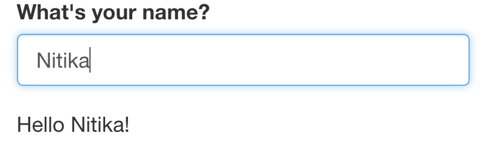
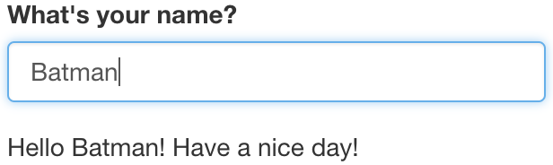
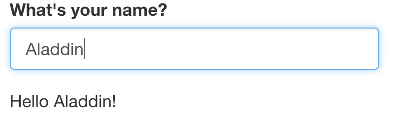

# Reactivity{#reactivity}

## Overview of Reactivity

In Section \@ref(structure), we mentioned that the Shiny server logic is based on reactive programming. The server takes input from the UI, runs the code chunks defined within, generates output and sends it to the UI. When you change the input, the server re-runs the code chunks and sends the updated output to the UI.

Consider the following example. The UI takes a single text input i.e. name of a person. The server concatenates the input string with "Hello" at the start and, "!" at the end, followed by another string "Have a nice day!", and returns the concatenated string to the UI and prints as output.
```{r, eval =F}
ui <- fluidPage(
    textInput("name", "What's your name?"),
    textOutput("greeting")
)

server <- function(input, output, session) {
    output$greeting <- renderText({
        paste0("Hello ", input$name, "!", "\n", "Have a nice day!")
    })
}
```
{width=50%}
{width=50%}
{width=50%}

### Challenge 3: Modify `greeting.R` to print the uppercase letters (breakout){- .challenge}
Open `ShinyApps/reactive/greeting.R` and edit the file to print the input name in uppercase letters. The new app should:

* Ask your name in lowercase letters, example: "batman".

* And outputs- "Your name in uppercase letters is: BATMAN".

Hint: Get help on  `toupper()`

## R expressiovs vs Reactive expressions

Most R code typically deals with static data. What makes Shiny apps magical is the fact that they are interactive which is made possible due to  reactivity. There are two important aspects to reactivity:

1. Reactive expressions produce the latest computation

2. Reactive expressions save re-computation.

Conside the following example. We assign a value of `5` to the variable `a`. Using R expressions, we add `10` to `a`, which prints the result as `15`. Then, we update the value of `a` to `10`. Even though, the new value of `a` is now `10`, nothing happens! This is because, we haven't called the expression `a + 10`. In order to see the updated output of our expression, we need to explicitly re-run the expression. This is how the R expressions work.

```{r, echo = T, eval = T}
a <- 5
(sum <- a + 10)
```

```{r}
a <- 10
sum
```

However, this problem could be solved by using a function. Here we create a function to add `10` to a number. 
```{r}
add10 <- function(num){
    result <- num + 10
    return(result)
}
add10(a)
```
Using a function gives us the latest compute with the latest input value. However, it doesn't save computation. The function will perform the computation even if the input value remains unchanged. That's just how functions work.

```{r}
add10(num=10)
```

When working with trivial examples or data sets, computation isn't an issue. But with increasing complexity, computation can be really expensive. We can save re-computation and get the latest computation with the magic of Reactive programming. Now, let's take a look at some reactive expressions.


The input of a reactive expression is called a reactive input. When we change the reactive input value `input$a`, the expression itself changes and re-executes itself, only if necessary.

Example of a reactive expression
```{r, echo = T, eval =F}
library(shiny)
y <- reactive(input$a + 1)
```

You can write the same expression in different ways:
```{r, eval =F}
# or
y <- reactive({
    input$a + 1
})

# or
y <- reactive({
    return(input$a + 1)
})
```

### Advanced: Workings of reactive expressions {- .advanced}
This is an optional section that explains the workings of reactive expressionsin a little more detail.

In the following example, we have a reactive input `input$a`, where `a =1`. We create a reactive expression, `expr1` which is just a function.
```{r, eval =F}
input <- reactiveValues(a=1)

expr1 <- reactive({
    (input$a + 3)*4})
```

`isolate()` helps us view the values of the reactive expression in the R console. 
```{r, eval =F}

isolate(expr1())
```

Now, we change the value of our reactive input and update the expression. Remember, we're not computing anything, we're just updating an expression.
```{r, eval =F}
input <- reactiveValues(a=5)

expr1 <- reactive({
    (input$a + 3)*4})
```


```{r, eval =F}
isolate(expr1())
```

## Accessing Reactivity

There are two types of functions that we can use to access reactivity. We can use `render` functions or the `reactive` function. In most simple examples of Shiny applications, we are able to directly connect/link an input widget and an output object with a `renderX` function (e.g `renderTable`, `renderText`, `renderPlot`). These `renderX` functions are activated/re-calculated whenever the value of `input$someInputId` provided to that `renderX` function is updated/changed.

In such situations, the result is directed to an output on the UI. But what if you wanted to use the calculated result for multiple outputs? Since the `render` function directs its result into an output, this means that this value is not freely available to be used by other `render` functions. One solution could be to run the calculation multiple times with each `render` function. This isn't a very efficient solution but it might be one that would do the job. However consider if the calculation was a very large one, rerunning this calculation multiple times might slow the app down a lot to the point of it becoming inoperable.

This is a situation where a `reactive` function would be useful. The output of a reactive function can be assigned to a variable name and this variable can be called within different `render` functions. Like a `render` function, the `reactive` function is recalculated any time the value of `input$anInputId` inside the reactive function is updated or changed. 

Therefore for a more efficient solution, the calculation could performed in the reactive function once and then in multiple `render` functions, the value of the `reactive` function could be called.

Here is an example without a `reactive` function, somewhat contrived:

```{r, eval = FALSE}
library(shiny)
data("airquality")

ui <- fluidPage(
  sliderInput(inputId = "tempModifier", label = "this slider will multiply the temperature column of the `airquality` dataset by the selected value", min = 0, 
        max = 100, value = 50),
  textOutput(outputId = "airResult"),
  plotOutput(outputId = "plotResult")
)

server <- function(input, output, session) {
  output$airResult <- renderText({
    new_temp <- airquality$Temp * input$tempModifier 
    paste0("the average of the modified temperature is:", mean(new_temp))
  })
  
  output$plotResult <-  renderPlot({
    new_temp <- airquality$Temp * input$tempModifier # we are performing the same calculation twice
    plot(x=airquality$Temp, y = new_temp, ylim = c(0, 8000))
  })
  
}

shinyApp(ui, server)
```

Here an example with a `reactive` function:

```{r, eval =FALSE}
library(shiny)
data("airquality")

ui <- fluidPage(
  sliderInput(inputId = "tempModifier", label = "this slider will multiply the temperature column of the `airquality` dataset by the selected value", min = 0, 
        max = 100, value = 50),
  textOutput(outputId = "airResult"),
  plotOutput(outputId = "plotResult")
)

server <- function(input, output, session) {
  # we've used a reactive function to create a reactive variable which can be used by both render functions 
  new_temp <-  reactive({
    airquality$Temp * input$tempModifier
  })
  
  output$airResult <- renderText({
    paste0("the average of the modified temperature is:", mean(new_temp()))
  })
  
  output$plotResult <-  renderPlot({
    plot(x=airquality$Temp, y = new_temp(), ylim = c(0, 8000))
  })
  
}

shinyApp(ui, server)
```


### Challenge 4: Create a function that uses pythagoras theorm to calculate hypotenuse, if height and base variables are given (breakout).{- .challenge}
In this challenge, you have 2 input sliders for `a` and `b` in the UI. Create a server function to compute pythagoras theorm and calculate hypotenuse.
```{r, eval = F}
ui_pythagoras <- fluidPage(
    titlePanel("Hypotenuse app"),
    sliderInput("a", "Length a", 0, 10, 5),
    sliderInput("b", "Length b", 0, 10, 5)
    )
```

