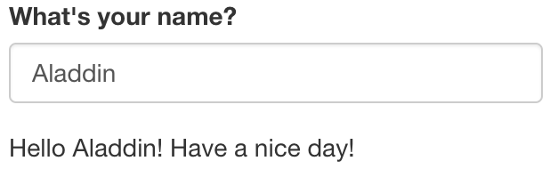

# Reactivity{#reactivity}

## Overview of Reactivity

In Section \@ref(structure), we mentioned that the Shiny server logic is based on reactive programming. The server takes input from the UI, runs the code chunks defined within, generates output and sends it to the UI. When you change the input, the server re-runs the code chunks and sends the updated output to the UI.

Consider the following example. The UI takes a single text input i.e. name of a person. The server concatenates the input string with "Hello" at the start and, "!" at the end and returns this string to the UI.
```{r, eval =F}
ui <- fluidPage(
  textInput("name", "What's your name?"),
  textOutput("greeting")
)

server <- function(input, output, session) {
  output$greeting <- renderText({
    paste0("Hello ", input$name, "!")
  })
}
```
{width=50%}
{width=50%}
{width=50%}

### Challenge 3: Modify `greeting.R` to print the reverse{- .challenge}
Open `ShinyApps/reactive/greeting.R` and edit the file to print reverse of the input name. The new app should print the following:

* Hello Batman!

* The reverse of your name is: namtaB

## Reactive expressions save recomputation

Example of a reactive expression
```{r, echo = T, eval =F}
library(shiny)
y <- reactive(input$x + 1)

# or
y <- reactive({
    input$x + 1
})

# or
y <- reactive({
    return(input$x + 1)
})
```

Reactivity explained using Pythagoras calculation: We have used `browser()` calls to debug the function
```{r, eval = F}
ui_pythagorus <- fluidPage(
    titlePanel("Hypotenuse app"),
    sliderInput("a", "Length a", 0, 10, 5),
    sliderInput("b", "Length b", 0, 10, 5),
    textOutput("result"))

server_pythagorus <- function(input, output, server) {
    a2 <- reactive({
        cat("Compute a squared.\n")

        input$a ** 2
    })
    browser()

    b2 <- reactive({
        cat("Compute b squared.\n")

        input$b ** 2
    })
    browser()

    output$result <- renderText({
        cat("Compute hypotenuse.\n")
        h <- sqrt(a2() + b2())
        cat("Done computing hypotenuse.\n")

        paste0("The hypotenuse is ", h)
    })
    browser()
}
```

Now, we run the function
```{r, eval = F}
server_pythagorus()
```

There are two types of functions that we can use to access reactivity. We can use `render` functions or the `reactive` function. In most simple examples of Shiny applications, we are able to directly connect/link an input widget and an output object with a `renderX` function (e.g `renderTable`, `renderText`, `renderPlot`). These `renderX` functions are activated/re-calculated whenever the value of `input$someInputId` provided to that `renderX` function is updated/changed.

In such situations, the result is directed to an output on the UI. But what if you wanted to use the calculated result for multiple outputs? Since the `render` function directs its result into an output, this means that this value is not freely available to be used by other `render` functions. One solution could be to run the calculation multiple times with each `render` function. This isn't a very efficient solution but it might be one that would do the job. However consider if the calculation was a very large one, rerunning this calculation multiple times might slow the app down a lot to the point of it becoming inoperable.

This is a situation where a `reactive` function would be useful. The output of a reactive function can be assigned to a variable name and this variable can be called within different `render` functions. Like a `render` function, the `reactive` function is recalculated any time the value of `input$anInputId` inside the reactive function is updated or changed. 

Therefore for a more efficient solution, the calculation could performed in the reactive function once and then in multiple `render` functions, the value of the `reactive` function could be called.

Here is an example without a `reactive` function, somewhat contrived:

```{r}
library(shiny)
data("airquality")

ui <- fluidPage(
  sliderInput(inputId = "tempModifier", label = "this slider will multiply the temperature column of the `airquality` dataset by the selected value", min = 0, 
        max = 100, value = 50),
  textOutput(outputId = "airResult"),
  plotOutput(outputId = "plotResult")
)

server <- function(input, output, session) {
  output$airResult <- renderText({
    new_temp <- airquality$Temp * input$tempModifier 
    paste0("the average of the modified temperature is:", mean(new_temp))
  })
  
  output$plotResult <-  renderPlot({
    new_temp <- airquality$Temp * input$tempModifier # we are performing the same calculation twice
    plot(x=airquality$Temp, y = new_temp, ylim = c(0, 8000))
  })
  
}

shinyApp(ui, server)
```

Here an example with a `reactive` function:

```{r}
library(shiny)
data("airquality")

ui <- fluidPage(
  sliderInput(inputId = "tempModifier", label = "this slider will multiply the temperature column of the `airquality` dataset by the selected value", min = 0, 
        max = 100, value = 50),
  textOutput(outputId = "airResult"),
  plotOutput(outputId = "plotResult")
)

server <- function(input, output, session) {
  # we've used a reactive function to create a reactive variable which can be used by both render functions 
  new_temp <-  reactive({
    airquality$Temp * input$tempModifier
  })
  
  output$airResult <- renderText({
    paste0("the average of the modified temperature is:", mean(new_temp()))
  })
  
  output$plotResult <-  renderPlot({
    plot(x=airquality$Temp, y = new_temp(), ylim = c(0, 8000))
  })
  
}

shinyApp(ui, server)
```
