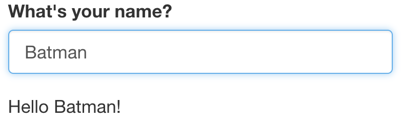

# Reactivity{#reactivity}
In Section \@ref(structure), we mentioned that the Shiny server logic is based on reactive programming. The server takes input from the UI, runs the code chunks defined within, generates output and sends it to the UI. When you change the input, the server re-runs the code chunks and sends the updated output to the UI.

Consider the following example. The UI takes a single text input i.e. name of a person. The server concatenates the input string with "Hello" at the start and, "!" at the end and returns this string to the UI.
```{r, eval =F}
ui <- fluidPage(
  textInput("name", "What's your name?"),
  textOutput("greeting")
)

server <- function(input, output, session) {
  output$greeting <- renderText({
    paste0("Hello ", input$name, "!")
  })
}
```
{width=50%}
{width=50%}
{width=50%}

### Challenge 3: Modify `greeting.R` to print the reverse{- .challenge}
Open `ShinyApps/reactive/greeting.R` and edit the file to print reverse of the input name. The new app should print the following:

* Hello Batman!

* The reverse of your name is: namtaB

## Reactive expressions save recomputation

Example of a reactive expression
```{r, echo = T, eval =F}
library(shiny)
y <- reactive(input$x + 1)

# or
y <- reactive({
    input$x + 1
})

# or
y <- reactive({
    return(input$x + 1)
})
```

Reactivity explained using Pythagoras calculation: We have used `browser()` calls to debug the function
```{r, eval = F}
ui_pythagorus <- fluidPage(
    titlePanel("Hypotenuse app"),
    sliderInput("a", "Length a", 0, 10, 5),
    sliderInput("b", "Length b", 0, 10, 5),
    textOutput("result"))

server_pythagorus <- function(input, output, server) {
    a2 <- reactive({
        cat("Compute a squared.\n")

        input$a ** 2
    })
    browser()

    b2 <- reactive({
        cat("Compute b squared.\n")

        input$b ** 2
    })
    browser()

    output$result <- renderText({
        cat("Compute hypotenuse.\n")
        h <- sqrt(a2() + b2())
        cat("Done computing hypotenuse.\n")

        paste0("The hypotenuse is ", h)
    })
    browser()
}
```

Now, we run the function
```{r, eval = F}
server_pythagorus()
```

## More comple examples of Shiny App:
