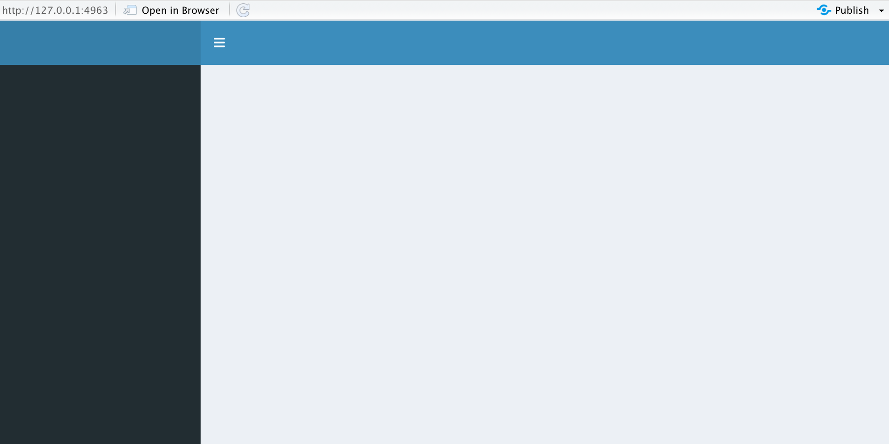

# Next steps{#nextsteps}

## Going fancy with Shiny Dashboards
```{r, eval = F}
library(shinyashboard)
```

This is the skeleton code for creating Shiny dashboards. There are three components to a Shiny dashboard:

1. Header

2. Sidebar

3. Body

```{r, eval = F}
library(shiny)
library(shinydashboard)

ui <- dashboardPage(
    dashboardHeader(),
    dashboardSidebar(),
    dashboardBody()
)

server <- function(input, output) { }

shinyApp(ui, server)

```

{width=100%}


